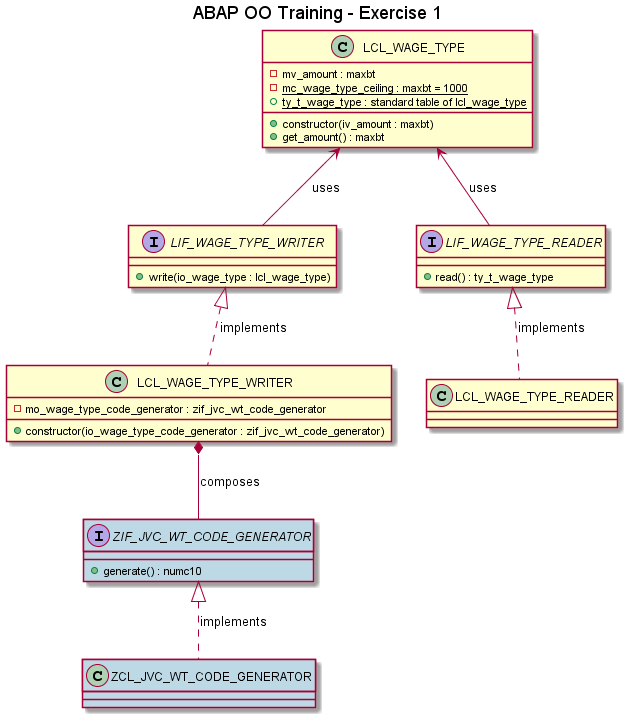

# Exercise 1

## Objective

1. Type an amount on the screen
2. When the user executes the program
   1. A wage type with this amount should be created
   2. This wage type should be saved
   3. All the wage types already created should be displayed

## Pre Implementation Steps

In these sequence of exercises, you will write to/read from a database table.

In order to have your own table, enter in SE11 transaction (in HRI) and copy table **ZJVC_T_WAGE_TYPE**.

For your exercises, you will use your own table and the structure **ZJVC_WAGE_TYPE**. You don't need to copy the structure since this one has the same fields as the database table.

## Details

- The max amount for a wage type is $1000.
- In this exercise, you can declare the objects and call them in the END-OF-SELECTION part of your report. 
- In exercise 2, you will understand why we are not creating an interface for wage types. 

## Example

To have an example, run **Z_ABAP_OO_BANK_1_JVC** in HRI. Do not spy the code before coding to not get spoilers.

## Concepts

- **Interfaces**
  - LIF_WAGE_TYPE_READER, for example, is an interface that defines only the 'contract' that any reader of wage types must follow  
- **Classes**
  - LCL_WAGE_TYPE_READER, for example, follows the contract of its interface and has the code that actually reads the wage types
- **Composition**
  - Remember: a composition is a relationship between two classes where one does not exist without the other.
    - For example: a CarMotor class only exists as part of a class Car. There is no reason in having a CarMotor without a Car.
  - to compose a LCL_WAGE_TYPE_WRITER object we need an implementation of ZIF_JV_WT_CODE_GENERATOR. This relationship is a composition because, in our program, there is no semantic reason for a code generator to exists without a wage type writer. 

## Class Diagram
- **Blue** classes/interfaces already exist. You do not have to create them again.
- **Green** classes/interfaces needs to be changed.
- **Yellow** classes/interfaces needs to be created.

