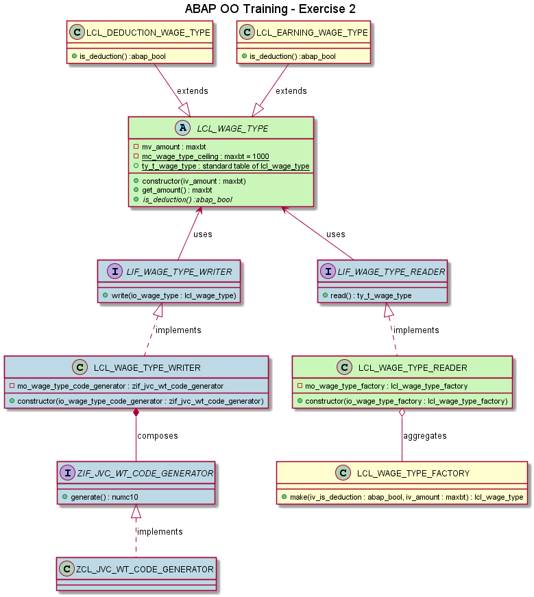

# Exercise 2

## Objective

1. Type an amount in the screen
2. Select if it is a deduction amount
3. When the user executes the program
   1. A wage type with this amount should be created
      1. The created class depends if it is a deduction or not
   2. This wage type should be saved
   3. All the wage types already created should be displayed

## Details

- LCL_WAGE_TYPE is now abstract.
- The decision of which subclass to use must be in LCL_WAGE_TYPE_FACTORY.
- You should use this factory also in the END-OF-SELECTION to create the right subclass according to the parameters.

## Example

To have an example, run Z_ABAP_OO_BANK_2_JVC in HRI.

## Concepts

- **Abstract Classes**
  - LCL_WAGE_TYPE is abstract because, in our exercises, every wage type should be a deduction or an earning wage type.
- **Inheritance**
  - LCL_DEDUCTION_WAGE_TYPE and LCL_EARNING_WAGE_TYPE are subclasses (children classes) of LCL_WAGE_TYPE. They are specific implementations of a wage type. Both share commom behavior (get_amount()), but also specific behavior (is_deduction()).
- **Method Override**
  - Method is_deduction() is abstract in LCL_WAGE_TYPE, therefore it needs to be implemented in subclasses. In both subclasses there is a redefinition of this method and it is overwritten.
- **Aggregation**
  - Remember: a aggregation is a relationship between two classes where one CAN exist without the other.
    - For example: an Author class is part a Book class, but an Author can exist in the system even with on published books.
  - to have a LCL_WAGE_TYPE_READER, we need LCL_WAGE_TYPE_FACTORY. However, it is an aggregation (and not a composition) because the wage type factory exists in our report without the wage type reader class. In fact, the wage type factory is also used in the END-OF-SELECTION.

## Class Diagram
- **Blue** classes/interfaces already exist. You do not have to create them again.
- **Green** classes/interfaces needs to be changed.
- **Yellow** classes/interfaces needs to be created.

