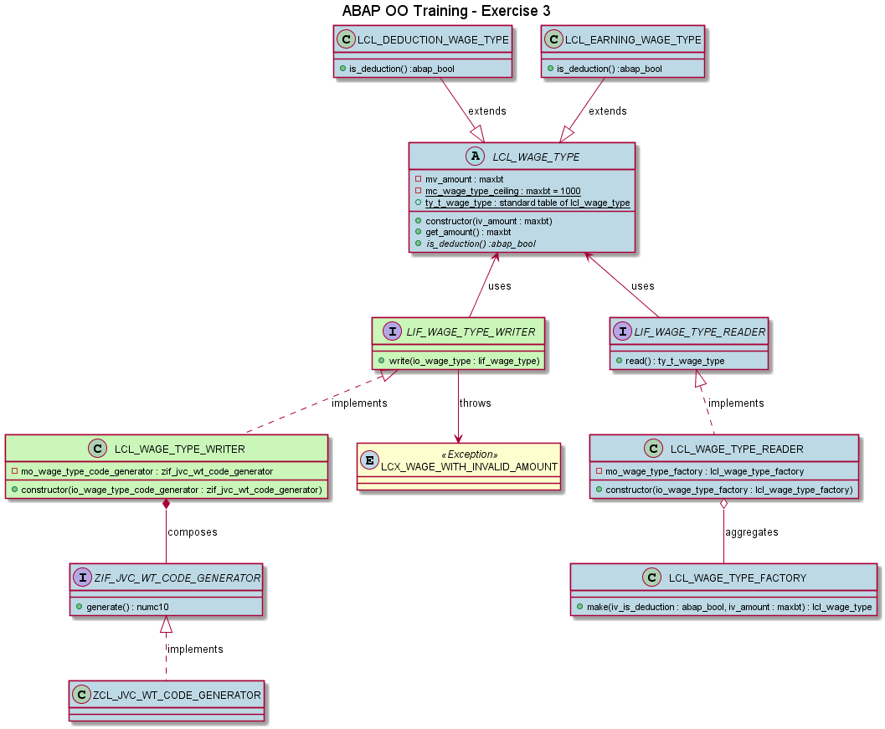

# Exercise 3

## Objective

1. Type an amount in the screen
2. Select if it is a deduction amount
3. When the user executes the program
   1. A wage type with this amount should be created
      1. The created class depends if it is a deduction or not
   2. Then:
      1. If the wage type has a non negative amount, it should be saved and all wage types should be displayed like Exercise 2
      2. Otherwise, the message 'A wage type can not have a negative amount' should be displayed
   

## Details
   - You can create LCX_WAGE_WITH_INVALID_AMOUNT inheriting from CX_STATIC_CHECK
## Example

To have an example, run Z_ABAP_OO_BANK_3_NEW_JVC in HRI.

## Concepts

- **Exceptions**
  - LIF_WAGE_TYPE_WRITER can raise an LCX_WAGE_WITH_INVALID_AMOUNT if the amount is negative. This behavior is in the writer and not in the wage type itself because our business says it is incorrect to have negative amount when writing wage types. In other contexts, it may be okay. Every place that calls LIF_WAGE_TYPE_WRITER should be prepared to handle this exception.

## Class Diagram
- **Blue** classes/interfaces already exist. You do not have to create them again.
- **Green** classes/interfaces needs to be changed.
- **Yellow** classes/interfaces needs to be created.

