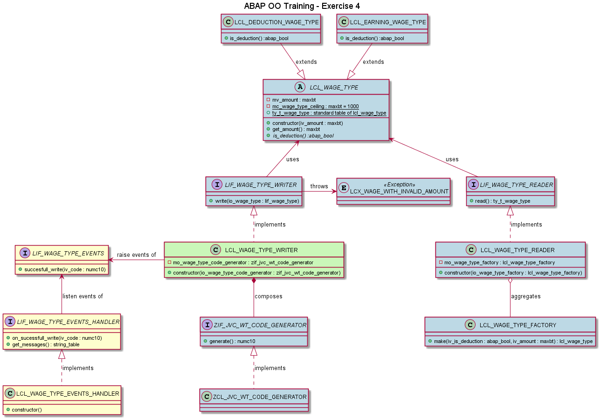

# Exercise 4

## Objective

1. Type an amount in the screen
2. Select if it is a deduction amount
3. When the user executes the program
   1. A wage type with this amount should be created
      1. The created class depends if it is a deduction or not
   2. Then:
      1. If the wage type has a non negative amount:
         1. the message 'Wage Type saved with code XX' should be displayed
         2. all wage types should be displayed 
      2. Otherwise, the message 'A wage type can not have a negative amount' should be displayed

## Details
   - LCL_WAGE_TYPE_WRITER must implements LIF_WAGE_TYPE_EVENTS since it raises an event from this interface
   - You can activate the listener with 'SET HANDLER me->lif_wage_type_events_handler~on_sucessfull_write FOR ALL INSTANCES.' on the constructor of LCL_WAGE_TYPE_EVENTS_HANDLER.
   - When the event is triggered, LCL_WAGE_TYPE_EVENTS_HANDLER must save a message in the format 'Wage Type saved with code XX', where XX is the iv_code parameter.
## Example

To have an example, run Z_ABAP_OO_BANK_4_NEW_JVC in HRI.

## Concepts

- **Events**
  - LIF_WAGE_TYPE_EVENTS define events and LIF_WAGE_TYPE_EVENTS_HANDLER define handlers (listeners) to these events. This example is very simple, but in real life, events are very useful. Imagine that you have a huge report that reads and process information from a lot of places. In this report, a lot of errors can happen and they all should be logged. One option is to pass a reference of a log object to every place that an error can happen. However, with events you can enable listeners that are waiting to handle errors and your code just have to trigger them.

## Class Diagram
- **Blue** classes/interfaces already exist. You do not have to create them again.
- **Green** classes/interfaces needs to be changed.
- **Yellow** classes/interfaces needs to be created.

